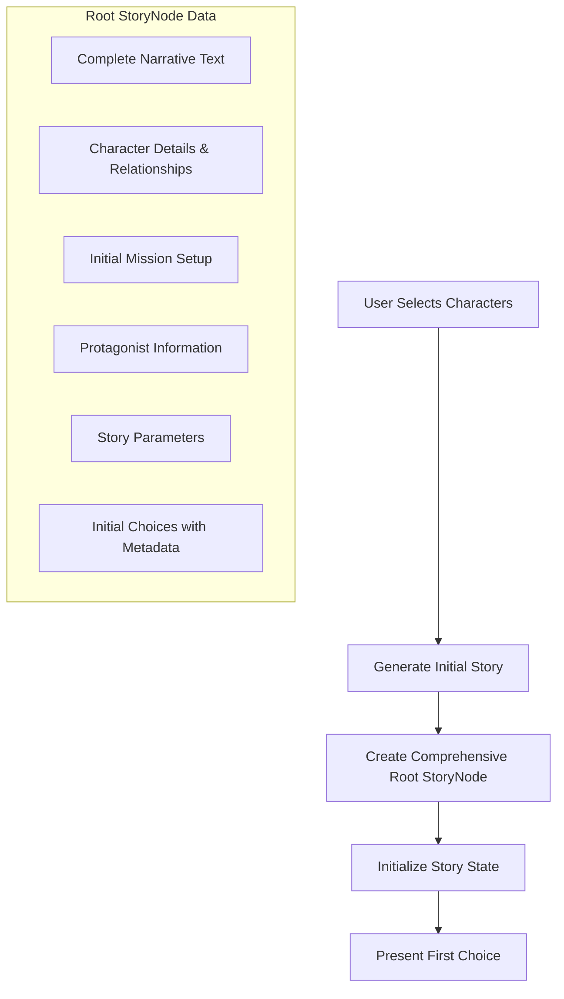
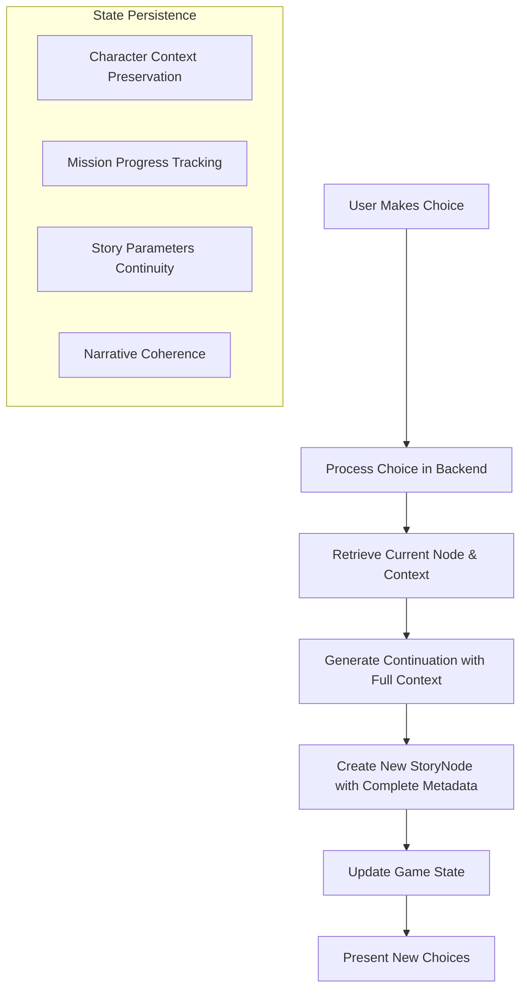

# Story Flow Documentation

## Game Overview
This is an interactive spy thriller where players navigate Chat-GPT generated missions as secret agents. Players make high-stakes decisions that affect the story's direction. The game combines narrative choice-based gameplay with mission progression systems and character context preservation. 

**Current Implementation Status**: The core story generation and continuation system is fully implemented, with comprehensive data persistence for characters, missions, and story context. Character relationship management and currency systems are planned for future development.

## Core Story Flow

### 1. Initial Story Generation


### 2. Choice Processing Flow


## Data Structures

### Comprehensive StoryNode Structure
```
StoryNode
├── narrative_text: Story segment content
├── parent_node_id: Reference to previous node
├── story_id: Reference to parent story
├── character_id: Primary character in this node
├── branch_metadata
│   ├── story_id: Story identifier
│   ├── choice_id: Selected choice that led here
│   ├── branch_id: Branch identifier
│   ├── timestamp: Creation time
│   ├── choice_text: Text of the selected choice
│   ├── characters: Array of character IDs
│   ├── character_details: Full character data
│   ├── mission_info: Current mission state
│   ├── mission_update: Changes to mission
│   ├── choices: Available choices with metadata
│   ├── protagonist: Player character details
│   ├── story_parameters: Conflict, setting, style, mood
│   ├── previous_node_id: Reference to parent
│   └── previous_choice: Previous choice ID
└── is_endpoint: Whether node is an endpoint
```

### Complete State Tracking
```
UserProgress
├── current_story_id: Active story reference
├── current_node_id: Current position in story
├── last_active: Timestamp of last activity
├── experience_points: Player progression
├── currency_balances: Available resources
├── active_missions: Ongoing objectives
├── encountered_characters: Character tracking
├── choice_history: Record of previous decisions
└── game_state: General state information
```

## Key Processes

### 1. Node Transition with Context Preservation
When a player makes a choice:
1. The current node is resolved using priority-based resolution:
   - First from UserProgress.current_node_id
   - Then latest node for the story
   - Finally root node as fallback
2. Story continuation is generated with comprehensive context:
   - Previous narrative content
   - All character details (traits, backstory, plot lines)
   - Current mission state and progress
   - Story parameters (conflict, setting, style, mood)
   - Protagonist attributes
3. A new StoryNode is created with complete branch_metadata
4. User progress is atomically updated with database transactions
5. All context is preserved for future continuations

### 2. Mission Integration
During node transitions:
1. Complete mission information is stored in branch_metadata
2. Mission progress is tracked and updated
3. Mission updates are included in the story node
4. Mission progress is reflected in the narrative
5. Story choices affect mission progression

### 3. Character Context Preservation
For consistent character portrayal:
1. Full character details are stored in branch_metadata
2. Character traits, backstory, and plot lines are preserved
3. Character context is maintained across story segments
4. New random characters can be introduced when needed
5. The AI has access to complete character histories

## Implementation Details

### State Management
- GameState class maintains the current game state
- GameStateManager provides a singleton for state synchronization
- State changes use database transactions for consistency
- Node transitions are atomic operations
- Rich context is maintained for story continuity

### Data Persistence
- StoryNode.branch_metadata preserves all context
- Character information is formatted consistently
- Story parameters are maintained across segments
- Protagonist details are preserved between nodes
- Previous node references ensure narrative continuity

### Error Recovery
If story continuation fails:
1. Database transaction is rolled back
2. Error is logged with details
3. User is presented with appropriate error message
4. System returns to last stable state

## Future Development

### Planned Features
1. **Character Relationship System**
   - Track relationship levels between characters
   - Affect dialogue and choices based on relationships
   - Enable character-specific storylines

2. **Currency and Experience System**
   - Implement currency types (💎 Premium Currency)
   - Track experience points from choices and missions
   - Enable purchases and upgrades

3. **Enhanced Mission System**
   - Add side missions and character-specific missions
   - Implement mission rewards and consequences
   - Create more complex mission structures

4. **User Experience Improvements**
   - Enhance loading animations
   - Add more detailed feedback
   - Improve error handling and recovery 