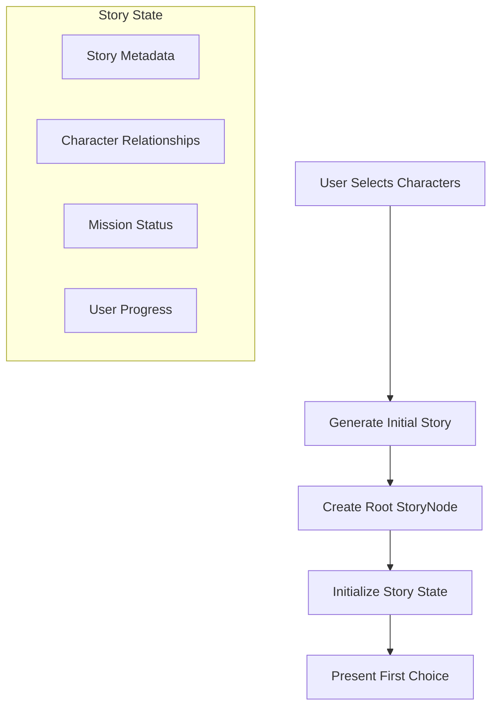
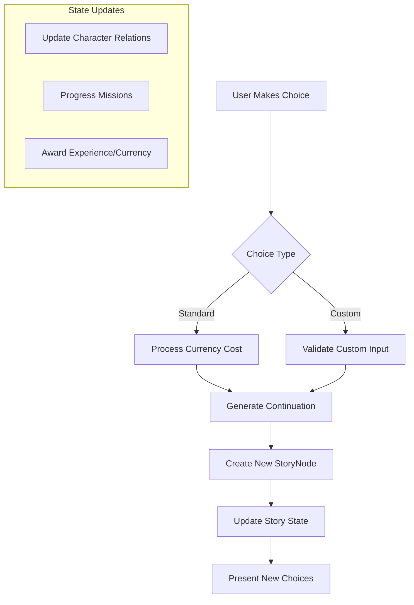
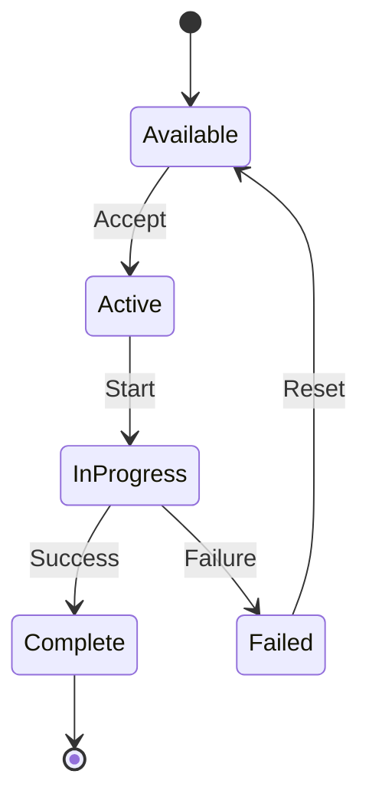
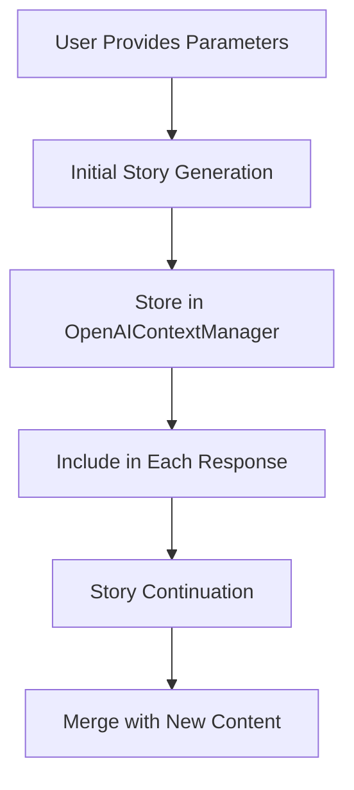

# Story Flow Documentation

## Game Overview
This is an interactive spy thriller where players navigate complex missions as secret agents. Players build relationships with AI-generated characters, make high-stakes decisions that affect the story's direction, and earn currencies and experience points. The game combines narrative choice-based gameplay with character relationship management and mission progression systems.

## Post-Story Generation Flow

### 1. Initial Story Generation


### 2. Choice Processing Flow


### 3. Data Flow Between Components

#### Story Generation → Story Node
```
StoryGeneration
├── generated_story (JSONB)
│   ├── narrative_text
│   ├── choices
│   └── metadata
└── current_node_id
    └── StoryNode
        ├── narrative_text
        ├── branch_metadata
        └── choices
```

#### User Progress Tracking
```
UserProgress
├── current_story_id
├── current_node_id
├── experience_points
├── currency_balances
├── active_missions
└── character_relationships
```

## Key State Transitions

### 1. Story Node Transition
When a choice is made:
1. Validate choice requirements (currency, etc.)
2. Generate story continuation
3. Create new StoryNode
4. Update UserProgress
5. Process mission updates
6. Update character relationships

### 2. Mission Updates
During node transitions:
1. Check mission triggers
2. Update mission progress
3. Award completion rewards
4. Generate new missions
5. Update user state

### 3. Character Relationship Updates
After each choice:
1. Calculate relationship changes
2. Update affinity scores
3. Unlock new character options
4. Update character-specific missions

## Currency and Experience System

### Currency Types
- 💎 Premium Currency
- 💷 Story Points
- ⭐ Character Tokens

### Experience Points
- Story Choices: 10-20 XP
- Mission Completion: 50-100 XP
- Character Relationship Milestones: 25-75 XP
- Custom Choice Creation: 15 XP

## Error Recovery States

### 1. Failed Continuation Generation
```
If story continuation fails:
1. Revert to last stable node
2. Refund any spent currency
3. Log error state
4. Present alternative choices
```

### 2. Invalid State Recovery
```
If state becomes invalid:
1. Load last known good state
2. Reconstruct story tree
3. Reattach current node
4. Rebuild choice options
```

## Mission Integration

### Mission Types
1. Main Story Missions
   - Progress core narrative
   - High rewards
   - Character relationship requirements

2. Side Missions
   - Optional content
   - Character-specific rewards
   - Currency farming opportunities

3. Character Missions
   - Relationship building
   - Unique dialogue options
   - Special rewards

### Mission State Machine


## Character Relationship System

### Relationship Levels
1. Stranger (0-20)
2. Acquaintance (21-40)
3. Associate (41-60)
4. Confidant (61-80)
5. Intimate (81-100)

### Relationship Effects
- Unique dialogue options
- Special mission availability
- Currency bonuses
- Custom choice options
- Story branch unlocks

## Technical Implementation Notes

### State Management
- Use transactions for all state changes
- Maintain state consistency across models
- Log all state transitions
- Implement rollback mechanisms

### Performance Considerations
- Cache frequently accessed nodes
- Lazy load relationship data
- Batch update character states
- Optimize choice validation

### Security Measures
- Validate all state transitions
- Prevent currency exploitation
- Secure custom choice input
- Rate limit story generations

### Story Parameter Flow


Key Parameter Preservation Points:
1. Initial capture in story generation
2. Storage in context manager
3. Inclusion in all API responses
4. Persistence through state management
5. Verification in continuation payload

## Future Considerations

### Planned Features
1. Multi-character missions
2. Dynamic relationship events
3. Character-specific storylines
4. Advanced currency mechanics
5. Achievement system

### Scalability
- Shard story data
- Cache popular paths
- Optimize node traversal
- Implement story archiving